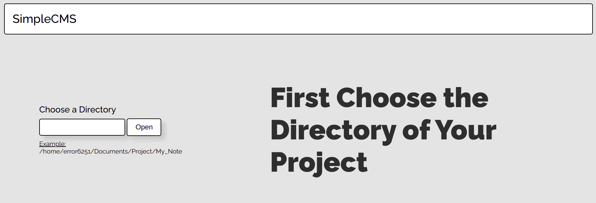
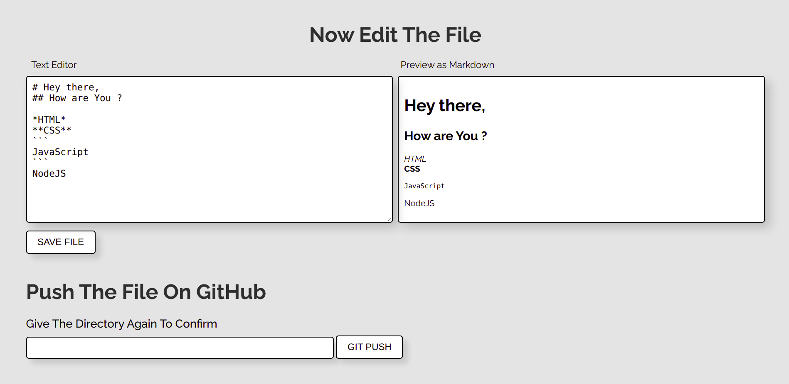

# simpleCMS
#### This is a simple CMS made with NodeJS
Demo project for cms  
  
  

**Installation:**
1. Download or coppy this on your local Folder
2. On your local folder open terminal and write `npm i`
3. Run this cms with `npm run dev`

You need git installed on you local to push the file on your Git. Making same push again can also create an error!